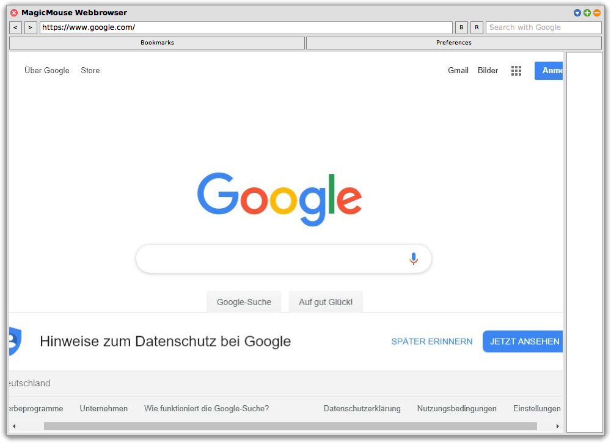
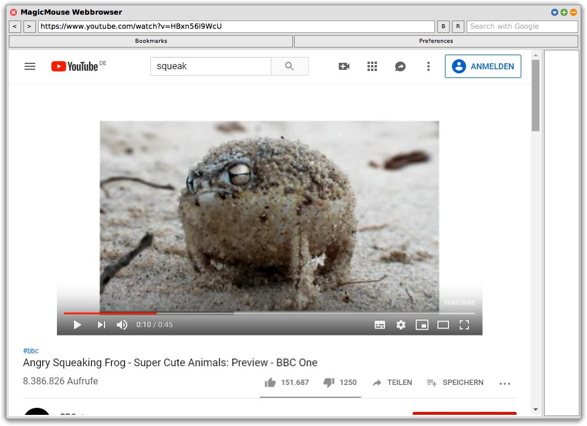
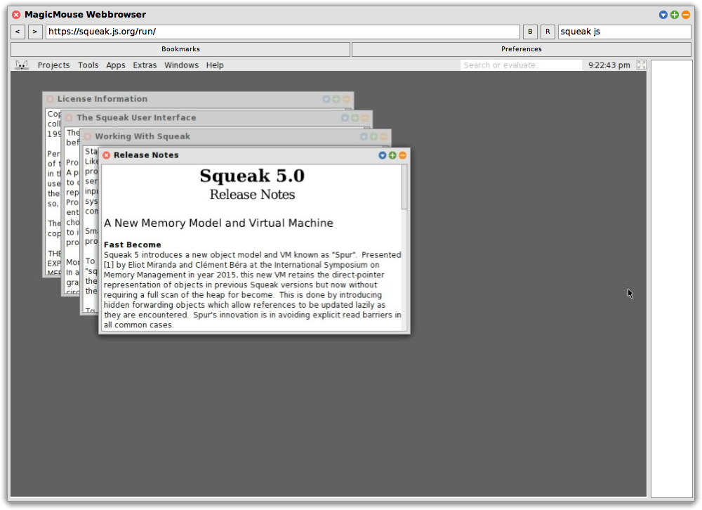
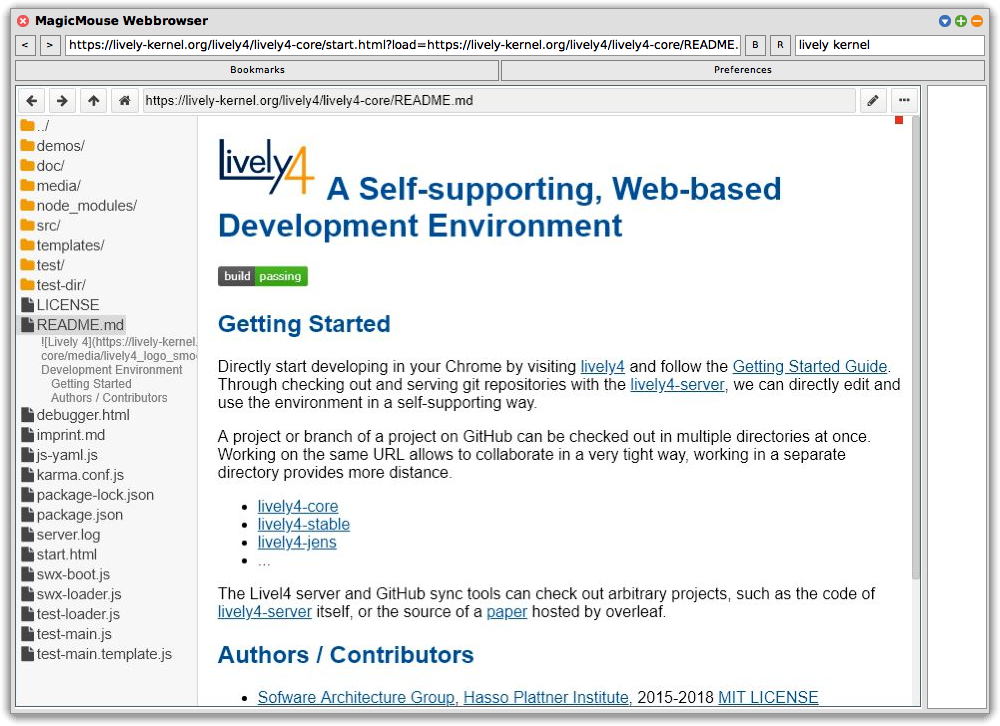

 MagicMouse Webbrowser
==================

[](https://travis-ci.com/cmfcmf/MagicMouse)

MagicMouse is a webbrowser for [Squeak](https://squeak.org). It uses Chrome/Chromium under the hood to render websites and displays them as ImageMorphs right inside Squeak.

MagicMouse runs on all platforms that run Squeak and Chrome, but works best and is most tested on Windows.

| | |
|-|-|
|  |  |
|  |  |

## Features

- Browse the web with a real browser right from Squeak.
- Watch YouTube videos in Squeak.
- Right-click on images and code to transform them into `Morph`s. I call those "Portals". Because portals are cool.
- Supercharged search bar:
  - If you type something with at least one space, your search terms are googled.
  - If you start your search with `!s `, your search terms are used to search https://squeak.org.
- `CTRL+L` toggles fullscreen.
- Dropped texts are typed into form fields.
- *browseIt* any URL to open it in a browser.
- Rick roll yourself! Send `rickRoll` to your favourite class or object to get started.
- Open browsers reconnect after resuming Squeak.
- Create and browse bookmarks.
- [Home Desktop System](https://github.com/hpi-swa-lab/home-desktop-system) integration:
  - Extracts structured data into `DomainObject`s
  - Searches for dropped `DomainObject`s
  - Fills form fields with dropped `DomainObject`s
- [Squot](https://github.com/hpi-swa/Squot) integration:
  - When browsing GitHub repositories, displays a direct download button that opens the repository in Squot.
- [Google Slides](https://slides.google.com) integration:
  - Display morphs right inside your presentation! Any rectangular boxes added to the slides whose text starts with `!` will be evaluated.
- [PolyCode](https://github.com/hpi-swa-lab/pp19-6-code-editor) integration:
  - Display mp3s, mp4s, svgs and more inside the code editor using MagicMouse.

## Installation

⚠ **See below for installation instructions if you want to develop MagicMouse!** ⚠

1. Install a recent version of Chrome or Chromium. MagicMouse uses the Chrome DevTools protocol to communicate with the browser and relies on the newish and experimental [`startScreencast`](https://chromedevtools.github.io/devtools-protocol/tot/Page#method-startScreencast) functionality. Chrome 76 works for me.
2. Install Squeak 5.2+ (you probably have that already :D).
3. Install MagicMouse via Metacello.
```smalltalk
Metacello new
	baseline: 'MagicMouse';
	repository: 'github://cmfcmf/MagicMouse:master/packages';
	load.
```

You will be prompted to download a binary that acts as a bridge between Squeak and Chrome. See the `MMPluginDownloader` for details. Binaries are stored at [Bintray](https://bintray.com/cmfcmf/MagicMouse/node-bridge/latest?tab=files#files/).

## Usage

MagicMouse provides two core classes for you to use: `MMBrowserMorph`, a simple image morph, and `MMBrowser`, a webbrowser with location and search bar.

In general, be advised that there is little to no error handling in place right now. If your webbrowser is no longer responding, there is a good chance it crashed. It is helpful to enable the `Enable debug` preference and watch the Transcript output to troubleshoot problems.

### `MMBrowserMorph`

This ImageMorph displays a website. It intercepts keyboard and mouse events and sends them to Chrome.
Open it by using the `open` or `openOn:` messages:

```smalltalk
MMBrowserMorph open "open with default url"

MMBrowserMorph openOn: 'https://github.com/cmfcmf/MagicMouse'
```

### `MMBrowser`

This tool features a location bar, a Google search bar and the browser content itself. Open it using:

```smalltalk
MMBrowser open "open with default url"

MMBrowser openOn: 'https://github.com/cmfcmf/MagicMouse'
```

## How it works

There are three components to make it work: Squeak, an intermediate Node.js script and Chrome.

### `run.js` <-[DevTools Protocol via WebSocket]-> Chrome

If you are using the prebuilt binary (default and recommended for people who don't want to develop MagicMouse), the `run.js` script is packaged together with Node.js into a single binary.
We use Node.js and the [puppeteer-core](https://www.npmjs.com/package/puppeteer-core) library to spawn and communicate with Chrome/Chromium. Puppeteer uses the [Chrome DevTools Protocol](https://chromedevtools.github.io/devtools-protocol/) to connect to Chrome. The DevTools protocol uses WebSockets for communication. The required Node.js script is located inside this repostiory and called `run.js`. It spawns the browser and then calls `startScreencast()` which instructs Chrome to regularly take a screenshot of the current window and send it to Node.js. Chrome is smart enough to only take screenshots when the page visually changes.

### Squeak <-[Pipe]-> `run.js`

Squeak communicates with the `run.js` script via `stdout`, `stdin` and `stderr`. Depending on the operating system, we either use OSProcess (Unix) or FFI (Windows) to pipe these streams into Squeak. We used ProcessWrapper on Windows previously, but found it rather unreliable.

### `stdout` and `stdin`

`stdout` and `stdin` are used for the communication between Squeak and `run.js`. We use a simple, custom protocol for communication. Each message starts with a `uint32_t` that specifies the length of the message in bytes. The following `char` identifies the type of the message. The rest of the message is specific to the message type. Some example messages include:

#### `stdout`: `run.js` -> Squeak

- browser screenshots
- location changes
- portal data (i.e., the data of an image that was requested by a "portal creation request")
- portal positions (everytime the page is re-rendered, an updated list of all portal positions is sent to Squeak)

#### `stdin`: Squeak -> `run.js`

- mouse movement, mouse events
- keyboard events
- viewport size changes
- portal creation requests
- location change requests

### `stderr`

`stderr` is used for debugging only. The `run.js` script prints debug information to `stderr`, which is read by Squeak and written to the Transcript if the `Enable debug` option is set.

## Installation for Developers

The installation is a bit cumbersome at the moment:

1. Install MagicMouse via Metacello like described above. This will also download necessary dependencies.
2. Install MagicMouse via the Git Browser.
3. Clone this repository using your command-line Git client (**not** Squit). Choose a different folder than when you cloned using Squit.
4. Run `yarn install` within the cloned repository. You may need to install [Yarn](https://yarnpkg.com/lang/en/).
5. Open the Squeak Perference Browser and
   - Change the `Git Repository Path` in the MagicMouse category to match the location of the cloned repository.
   - Check the `Do not use prebuilt binary` option.
   - You probably also want to enable the `Enable debug` property to log debug output to the Transcript.
